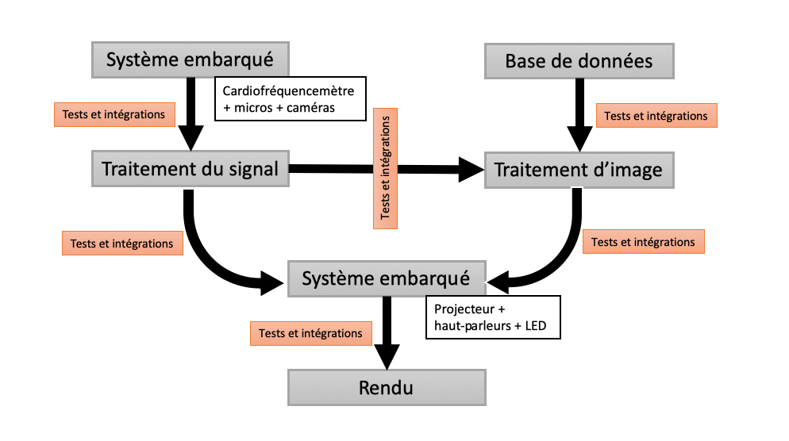

=== Description des interfaces (PAN1 / PAN2)
////
Pour le PAN1, il faut identifier et décrire sommairement toutes les
interfaces entre modules.

Pour le PAN2, il faut une description complète des interfaces.

Il faut ici une description textuelle de chaque interface, c'est-à-dire chaque
échange entre deux blocs.
Si c’est une interface entre deux blocs informatiques, c’est une interface
Java.
S’il y a des échanges de données complexes, il faut en décrire le format avec
précision.
Si c’est une interface entre deux blocs électroniques, c’est une description
des signaux électroniques ou protocoles utilisés.

==== InterfaceBloc1-2

Description textuelle d’interface

==== InterfaceBloc2-4

Description textuelle d’interface
////

._Schéma de déscription d'interfaces_

** L'utilisateur arrive dans une pièce. On prélève son rythme cardiaque avec un cardiofréquencemètre, son timbre de voix avec un micro et une photo de lui avec un appareil photo. Ces données seront traitées et analysées. Il y a ici le premier lien entre modules de *systèmes embarqués* et *traitement du signal*.

** Ces signaux seront ensuite transmis à un algorithme de traitement d'images qui produira l'image souhaitée. On a là un lien entre les modules *traitement du signal* et *traitement d'images*.

** Ce même algorithme se basera sur des références pour produire une image. On aura alors besoin d'une base de données adéquate. Il y a ainsi un lien entre  *base de données* et *traitement d'images*.

** Les modules de traitement du signal et d'images auront pour fin la création d'une ambiance : image, son, lumière. Il faudra alors retourner et présenter cette ambiance à l'utilisateur via un projecteur, des leds, des hauts parleurs. Il y aura alors un lien entre les modules *traitement d'images et du signal* et *systèmes embarqués*.

** Enfin, l'image projetée par le projecteur sera en 2D. Pour pouvoir l'afficher en 3D, il faudra utiliser une méthode spécifique, appelée stéréoscopie. Il y a donc un lien entre les modules *systèmes embarqués* et *rendu*.

** Pour chacun des liens entre modules, il faudra s'assurer du bon fonctionnement des transmissions. Le module *tests et intégrations* sera ainsi directement en lien avec tous ces modules.
