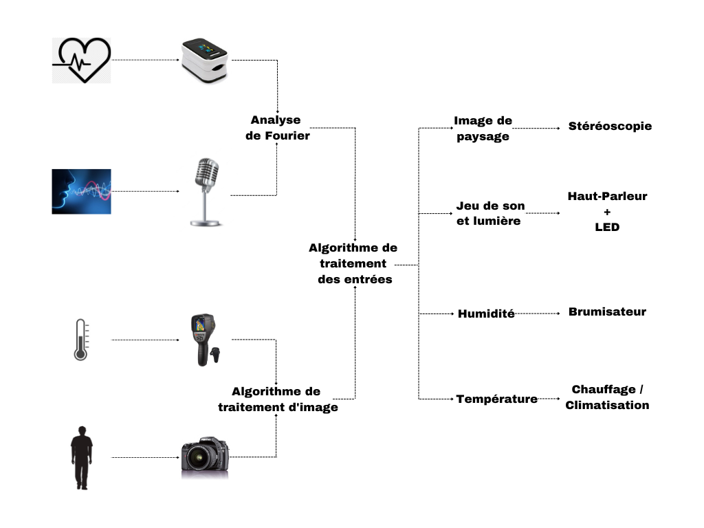

=== Schéma d’architecture
////
Insérer ici un ou plusieurs schémas d’architecture du projet. Voir le
cours d’introduction au Génie Logiciel. N’hésitez pas à faire des
schémas hiérarchiques, c'est-à-dire avec un bloc d’un schéma général
raffiné dans un second schéma ; ou des schémas en plusieurs parties.

*Exemple utilisant http://www.graphviz.org/Documentation.php[graphviz]*
Voir la liste des outils supportés par http://asciidoctor.org/docs/asciidoctor-diagram/[asciidoctor-diagram].
**(Vous pouvez, bien sûr, utiliser votre outil de dessin préféré).**

[graphviz, arch-diag, svg]
....
digraph MonGraph {
    graph [rankdir = LR, splines=ortho];

    node[shape=record];
    BlocIn[label="La source", height=2];
    Hub[label="Le «dispatcheur»", height=4];

    BlocOut1[label="Première sortie", height=2];
    BlocOut2[label="Seconde  Sortie", height=2];

    BlocIn -> Hub [label="Image"];
    BlocIn -> Hub [label="Son"];
    BlocIn -> Hub [label="Émotion"];

    Hub -> BlocOut1 [label="Musique"];
    Hub -> BlocOut1 [label="Chant"];
    BlocOut1 -> Hub [label="commande"];

    Hub -> BlocOut2 [label="Image"];
    Hub -> BlocOut2 [label="commande"];
}
....
////
._Schéma d’architecture_

==== Description des blocs

===== Les données personnelles 

Battement cardiaque : Le battement cardiaque de l’utilisateur est récupéré grâce à un cardiofréquencemètre.

La voix : Le timbre de la voix de l’utilisateur est récupéré grâce à un microphone.

La chaleur corporelle : La chaleur corporelle est récupérée grâce à une caméra thermique.

L’image de la personne : L’utilisateur est photographié grâce à un appareil photo.

===== L’analyse des entrées 

Le battement cardiaque et la voix de l’utilisateur sont analysés grâce à une analyse de fourier. Cela nous permettra de récupérer les fréquences principales de la voix et du battement cardiaque de l’utilisateur. Nous interprétons ces fréquences comme des couleurs selon une échelle de correspondance. Deux couleurs sont générées.

L’image thermique et la photographie de l’utilisateur sont traitées grâce à un algorithme de traitement d’image. Cet algorithme dégage les couleurs principales de ces deux images. Deux couleurs sont générées par le traitement de la photo et une couleur est générée par le traitement de l’image thermique. Trois couleurs sont générées au total.

===== Base de données

Il est nécessaire de créer une base de données d’images de paysage pour notre algorithme de génération de paysage. Pour cela nous allons récupérer une base de données de paysages sur internet que nous allons traiter pour que chaque image fasse la même taille et nous assurer que chaque image est bien une image de paysage.

===== Algorithme de traitement des entrées 

** Génération de l’image de paysage : Nous disposons d’une base de données d’images de paysages. Nous analysons la base de données pour faire correspondre à chaque image un panel de 5 couleurs principales. Les 5 couleurs générées en entrée nous permettent de sélectionner une image de cette base de donnée : la « plus proche » en termes de couleurs. Un algorithme de recolorimétrie adapte cette image pour qu’elle corresponde au mieux aux couleurs en entrée. Un dernier algorithme génère une seconde image avec une vue décalée par rapport à la première afin de donner un effet d’impression 3D à l'utilisateur grâce à la stéréoscopie.

** Génération du son : Nous souhaitons récupérer une banque de musique d’ambiance et faire correspondre une couleur à chacune de ces musiques en fonction de leur tonalité. Nous sélectionnons la musique correspondant au mieux aux couleurs en entrée.

** Humidité : Si l’ambiance de l’image générée le nécessite, nous souhaitons modifier l’humidité de la pièce

** Température : Nous modifions la température de la pièce pour qu’elle corresponde à la température suscitée par l’image de paysage.

===== Intégration

** Stéréoscopie : grâce à un écran particulier muni d’une grille très fine, chaque œil perçoit une image différente. Cela permet de donner une impression de profondeur à l’image visualisée.

** Son et lumière : la musique est jouée grâce à des haut-parleurs. Nous allumons des leds de la couleur principale en entrée.

** Humidité : Nous modifions l’humidité de la pièce grâce à un brumisateur.

** Température : Nous modifions la température de la pièce grâce à du chauffage ou un climatiseur.

////
Il faut ici une description textuelle de chaque bloc, sa fonction
détaillée. En général, un bloc correspond à un module, sauf exception.
Il peut être adapté de faire des blocs plus petits qu’un module.

Il est important ici de distinguer les bibliothèques identifiées et
disponibles de ce que vous allez produire (coder) vous-même. Vous ne
devez pas réinventer la roue, mais vous ne devez pas non plus avoir votre
projet tout fait en encapsulant un programme déjà existant.

===== NomBloc1

Description textuelle du bloc 1.

===== NomBloc2

Description textuelle du bloc 1.

*Exemple utilisant http://blockdiag.com/en/actdiag/index.html[actdiag]*
**(Vous pouvez, bien sûr, utiliser votre outil de dessin préféré).**

[actdiag, diag_activite, svg]
....
actdiag {
  ecrire -> convertir -> afficher

  lane user {
     label = "User"
     ecrire [label = "Décire les matrices"];
     afficher  [label = "Afficher la courbe"];
  }
  lane converter {
     label = "Convertisseur"
     convertir [label = "Convertir\n en utilisant\n@@"];
  }
}
....

Voir la liste des outils supportés par http://asciidoctor.org/docs/asciidoctor-diagram/[asciidoctor-diagram].
////