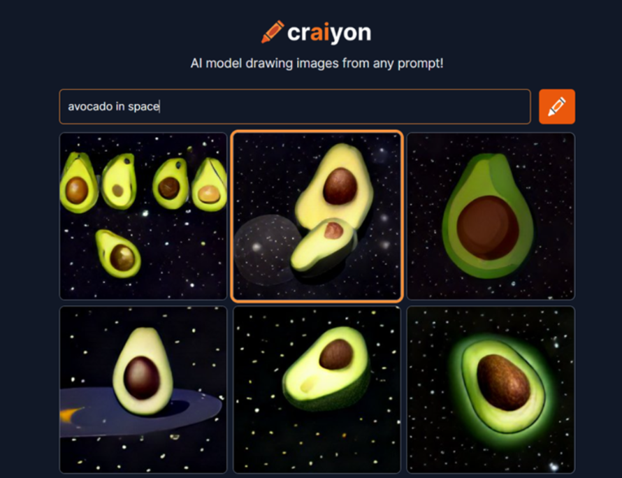
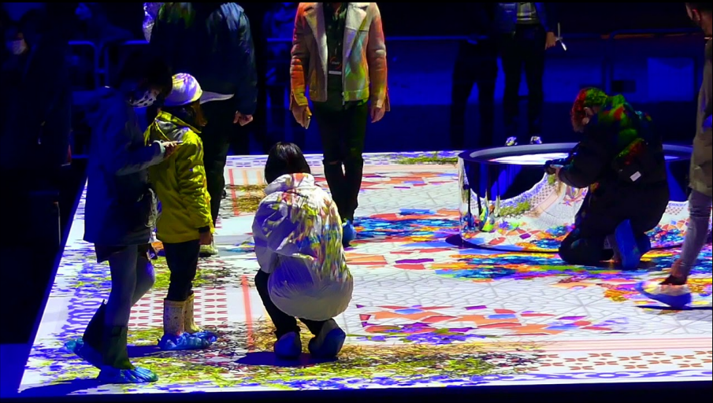

=== Description de l’état de l’art
////
ifdef::env-gitlab,env-browser[:outfilesuffix: .adoc]

Décrivez, en les citant via la bibliographie, les approches/produits
ressemblant à votre projet et les différences éventuelles. Illustrez
avec des images si besoin. Utilisez des renvois vers votre
bibliographie : « comme démontré dans [2], … »
////
==== DALL-E / DALL-E mini

Il s’agit d’un réseau neuronal créé par OpenAI pour générer des images à partir d’une phrase de description. DALL-E mini est un modèle open source avec moins de paramètres, la génération des images est moins complexe que DALL-E mais sa documentation est très complète dans le GitHub avec des explications sur le codage, décodage des images etc… C’est une bonne référence pour qu’on puisse apprendre à entraîner notre modèle IA.

DALL-E mini fournit un modèle open source qui a été entraîné avec des millions d’images associés aux textes sur Internet. Il peut créer les images qui n’existent pas en combinant les différents concepts qu’il a appris. Premièrement, il faut avoir une grande quantité de données pour entraîner les modèles dans codage ou décodage des textes et des images. C’est similaire avec ce que notre projet fait, ce qui différencie notre projet est le paramètre donné, nous donnons un paramètre propre à des couleurs correspondant à l'utilisateur, ce qui rend notre image unique.

Référence : <<DALL-E Mini>>

._Exemple de DALL-E Mini_

==== Jardin de Lumière 

Il s’agit d’une œuvre visuelle, sonore et olfactive. Au fur et à mesure qu’on marche sur une surface, des animaux et des végétaux apparaissent.

Référence : <<Jardin de Lumière - Nuit Blanche 2020>>

._Jardin de Lumière_

////
==== Exemples de citations

Les références bibliographiques sont regroupées dans le fichier `References.adoc`
à la racine du répertoire `rapport`.
On peut y faire référence dans toutes les sous parties du document.

On peut citer comme exemple l'article de Claude E. Shannon sur la
théorie de la communication <<Jardin de Lumière - Nuit Blanche 2020>>
ou, bien évidement, la vitrine des projets PACT <<VitrinePACT>>.

Voir <<TOTO,la référence>> très intéressante elle aussi.
////